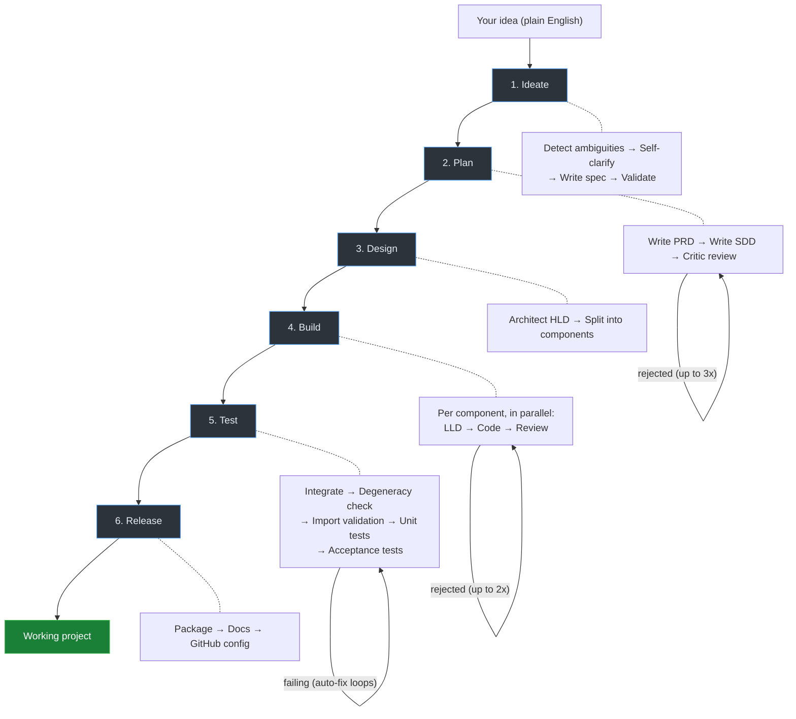

# Summon

[](https://pypi.org/project/summon-ai/)
[](https://pypi.org/project/summon-ai/)
[](LICENSE)
[](https://github.com/npow/summon/actions/workflows/ci.yml)

**When I have an idea, I want a working project — not "almost works".**

You shouldn't need to write a spec, plan an architecture, scaffold files, wire up tests, and package a release just to validate an idea. Summon collapses the entire software development lifecycle into a single command.

```bash
summon run "CLI tool that converts markdown to PDF" -o ./md2pdf
```

What comes out isn't scaffolding or boilerplate. It's a working project with real implementations, tests that pass, and packaging ready to go.

## The problem

Turning an idea into a working project requires a long chain of tasks that are individually straightforward but collectively exhausting:

- Clarify what you actually mean (resolve ambiguities in your own idea)
- Write a spec, then an architecture doc, then a design
- Implement each component, review the code, fix issues
- Wire everything together, validate imports, write tests, fix failures
- Package it, write docs, set up CI

Each step depends on the last. Skip one and the rest fall apart. Do them all manually and you've burned hours before writing a line of real logic.

**Summon's job:** take a plain-English description and do all of that — automatically, with quality gates and fix loops at every stage — so you get a working project back.

## How it works

Your idea flows through six stages. Each stage has built-in feedback loops that catch and fix problems before moving on.



If tests fail, a bug-fixer agent reads the errors and patches the code. If the critic rejects the plan, the planner revises. If imports break, an import-fixer rewires them. If generated code is degenerate (all stubs, repetitive, or truncated), it gets regenerated from scratch. Every fix loop has a retry cap so runs always terminate.

## Quickstart

```bash
# Install
git clone https://github.com/npow/summon && cd summon
uv sync --all-extras

# Set your API key
export ANTHROPIC_API_KEY=sk-...

# Build something
summon run "youtube transcriber that takes a URL and returns the transcript as text" -o ./yt-transcriber
```

## Stepped workflow

Run stages individually to inspect and edit between steps:

```bash
summon ideate "your idea"              # idea → spec.json
summon plan my-tool.spec.json          # spec → plan.json
summon design my-tool.plan.json        # plan → design.json
summon build my-tool.design.json -o .  # design → working project
```

Each stage outputs a JSON file you can read, modify, and feed into the next stage.

## Configuration

Works with Claude (default) or OpenAI models:

```yaml
models:
  supervisor: "claude-sonnet-4-20250514"   # or "gpt-4o"
  coder: "claude-sonnet-4-20250514"
  test_writer: "gpt-4o-mini"              # cheaper models for simpler tasks
```

```bash
summon run "your idea" -c summon-openai.yaml   # full OpenAI config
```

## Options

```
-c, --config PATH    Config file (default: summon.yaml)
-o, --output PATH    Output directory
-v, --verbose        Show what's happening
--skip-gates         Skip quality gates
--dry-run            Skip GitHub/publishing
```

## Limitations

- **Python-only (for now).** The full pipeline — degeneracy detection, import validation, acceptance tests, and packaging — is built for Python projects. TypeScript and Go have basic dep-install and test-run support but no quality gates or fix loops.
- **Single-process CLI tools and libraries.** Summon works best for self-contained projects: CLI tools, libraries, data scripts. It doesn't generate infrastructure, databases, frontends, or multi-service architectures.
- **LLM cost.** A full run makes many LLM calls across 6 stages. Simple ideas may cost a few dollars; complex ones with multiple retry loops will cost more.
- **No interactive clarification.** Ambiguities in your idea are resolved by the LLM, not by asking you. If the LLM guesses wrong, edit the spec JSON and re-run from that stage.

## Requirements

- Python 3.11+
- An API key for [Anthropic](https://console.anthropic.com/) or [OpenAI](https://platform.openai.com/)
- [uv](https://github.com/astral-sh/uv) (recommended) or pip

## Contributing

```bash
git clone https://github.com/npow/summon && cd summon
uv sync --all-extras
uv run pytest tests/ -v
```

## License

[MIT](LICENSE)
